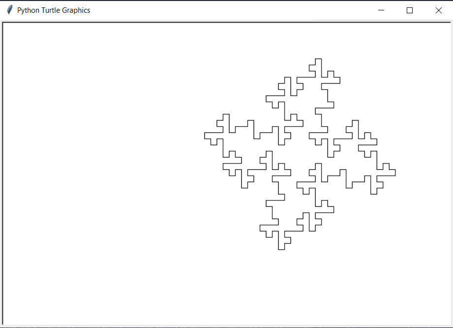
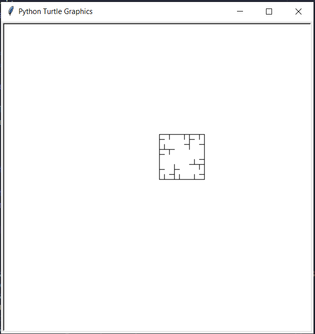
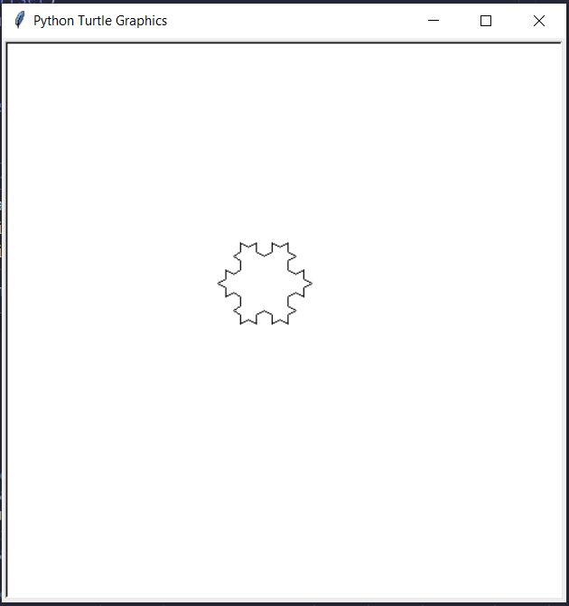

# Programa graficador de fractales

## **Turtle**

Se hizo uso del módulo turtle para la graficación de los fractales debido a que permite graficar con instrucciones como lo son el moverse hacia adelante y girar en cierto angulo a cada lado.

```python
import turtle
```

## **L-Systems**

Bajo el principio de L-Systems funciona ***logic*** definiendo a:

- ***alphabet*** como el conjunto de símbolos que el logica va a utilizar.
  - 'F': Mover hacia adelante (del inglés Fowards).
  - '+': Girar a la derecha.
  - '-': Girar a la izquierda.

```python
    def drawLogic(t, instructions, angle, distance):
    for i in instructions:
        if i == 'F':
            t.forward(distance)
        elif i == '+':
            t.right(angle)
        elif i == '-':
            t.left(angle)
```

- ***axiom*** como la cadena original que se utiliza en la generación.
- ***rules*** que indica como debe ser reemplazado cada uno de los símbolos en la siguiente iteración.
  
>para conocer mas del principio de L-Systems de click [aquí](https://www.youtube.com/watch?v=f6ra024-ASY&feature=emb_title)

## **Main**

La funcion main es la que recibe todos los parametros, tanto axiomas como tamaños de le ventana grosor de trasado entre otros.

```python
def main(iterations, axiom, rules, angle, length=10, size=1, y_offset=0,
         x_offset=0, offset_angle=0, width=500, height=500)
```

lo primero que se hara es cargar nuestros axiomas, reglas y numero de iteraciones al metodo ***logic***.

```python
inst = logic(iterations, axiom, rules)
```

posteriormente se creara la *ventana* y el *"lapiz"* proporcionandoles el tamaño.

```python

    t = turtle.Turtle()
    wn = turtle.Screen()
    wn.setup(width, height)

    t.up()
    t.backward(-x_offset)
    t.left(90)
    t.backward(-y_offset)
    t.left(offset_angle)
    t.down()
    t.speed(10)
    t.pensize(size)
```

ya definida nuestra *ventana* y *lapiz* se pasan lo parametros al metodo ***drawLogic*** que interpretara el axioma, las reglas y guiara el trazado de la linea en pantalla

```python
drawLogic(t, inst, angle, length)
```

```python 
def drawLogic(t, instructions, angle, distance):
    for i in instructions:
        if i == 'F':
            t.forward(distance)
        elif i == '+':
            t.right(angle)
        elif i == '-':
            t.left(angle)
```

## Ejemplos

Estos con algunos ejemplos que se pueden introducir al metodo ***main***.


```python
axiom = "F+F+F+F"
rules = {"F":"F-F+F+FFF-F-F+F"}
iterations = 2
angle = 90
```


```python
axiom = "F+F+F+F"
rules = {"F":"FF+F++F+F"}
iterations = 2
angle = 90
```

```python
axiom = "F--F--F"
rules = {"F":"F+F--F+F"}
iterations = 2
angle = 60
```
